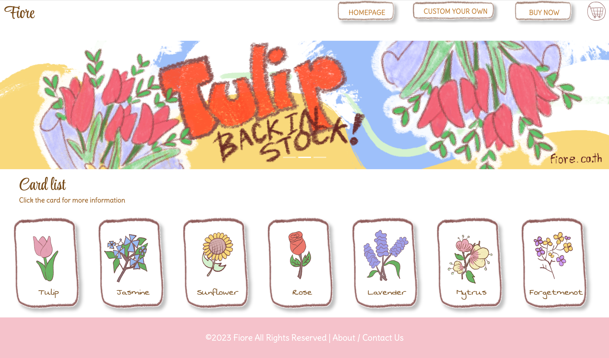
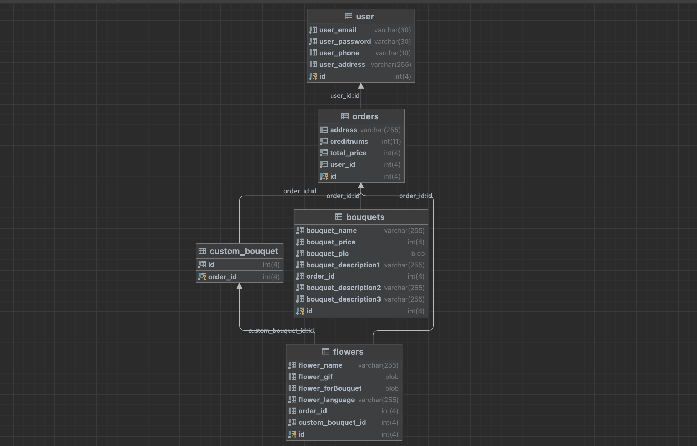
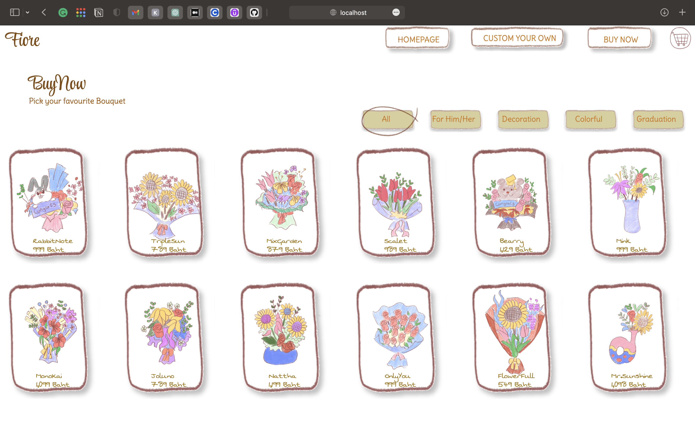
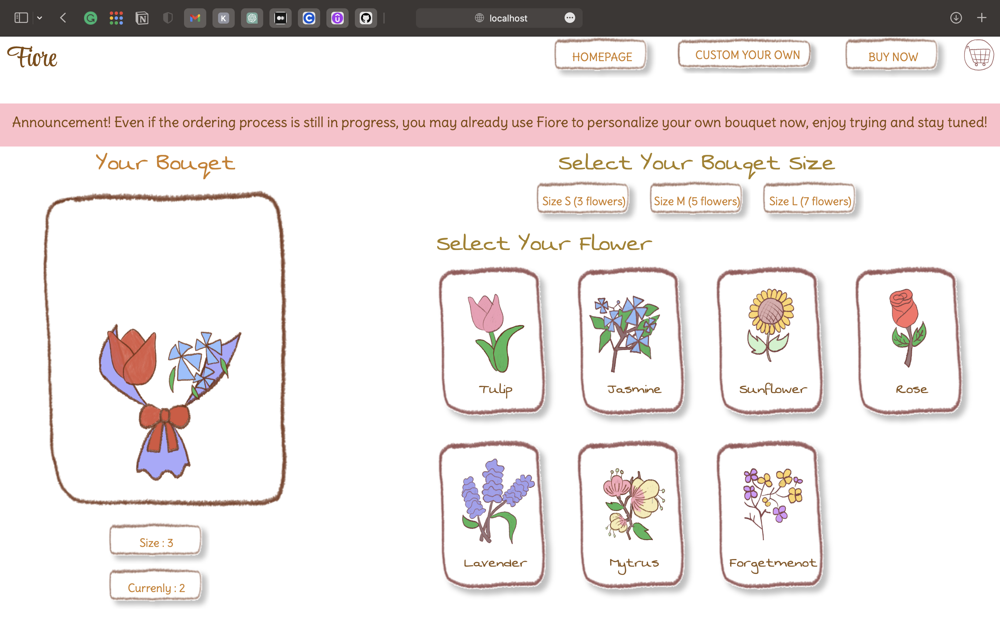

# Fiore Project 🌷✨
### Final Project fpr CSC105 Web-Application Development 

 ✨ Fiore is online E-commercial Website project which provide user to buy their own favourite bouquet. Gimmick of Fiore is All website are created by digital crayon artwork which would be fabulous and memorable experiences for user.
  

 

 
  

 
  
   
## 🌼 Function 
   - **Login/Register** Customer can Login and Authen to our website to store their order history.
   - **BuyNow** Customer can make and order here by selecting their Bouquet and order will be display on Cart.
   - **CardList** Customer can try to read more information of the flower by clicking on the flower card on homepage, they will pop up some informative thingly.
   - **CreateOwnBouquet** Customer can create their own bouquet by just selecting the size and flower they like ( User can try to Custom their own but there are not allow to make an order yet)
    

## 🌸 Database Schema 

 
  
  

## 🍁 To Run Frontend and Backend Mode
   
     cd ./client 
     yarn add 
     run dev 
     cd ./server
     npm run dev

## 💐Preview page
   

     

       

   
## 🌹 API Endpoint
         
        
  
